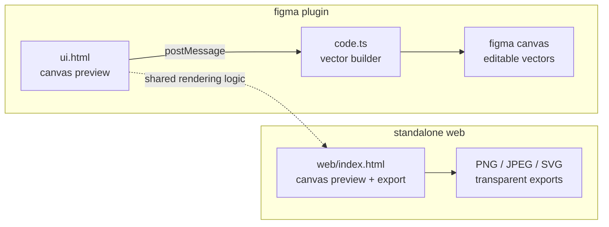
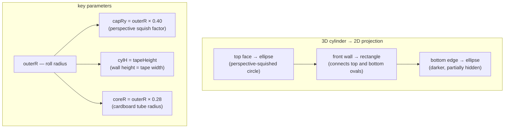
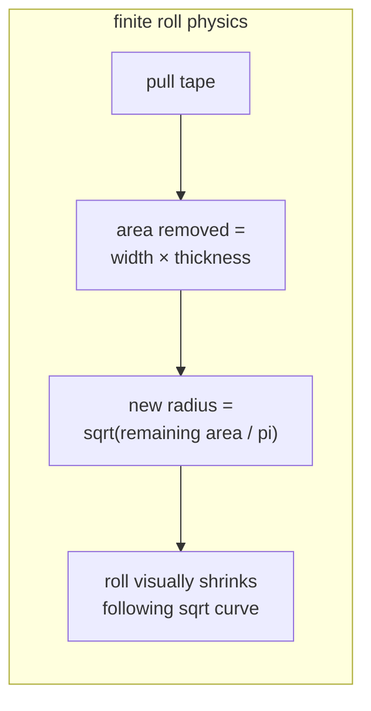
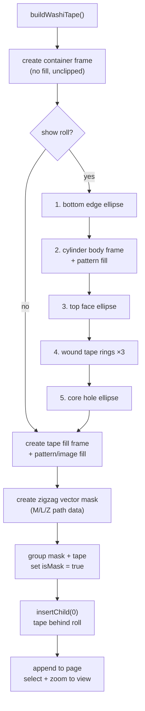
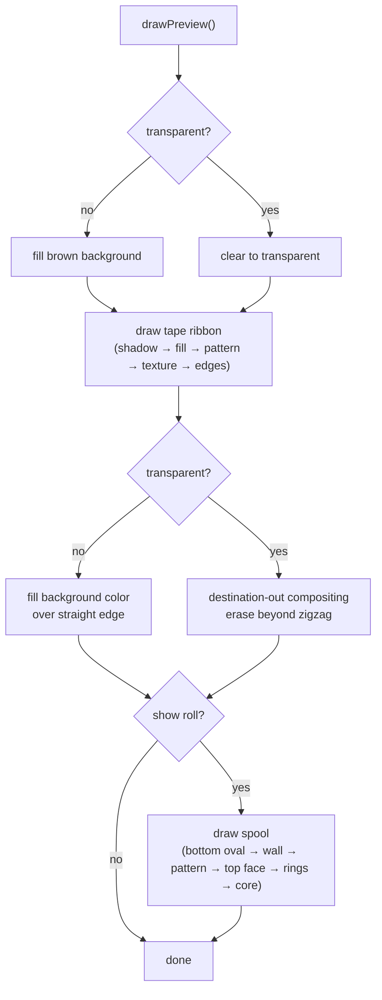
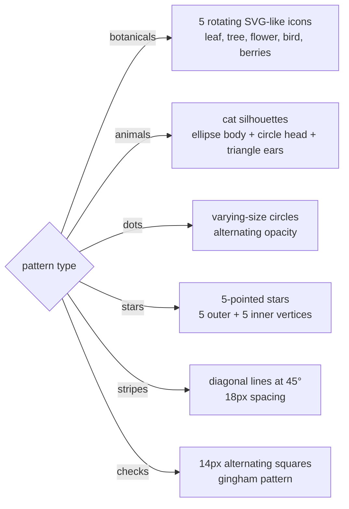
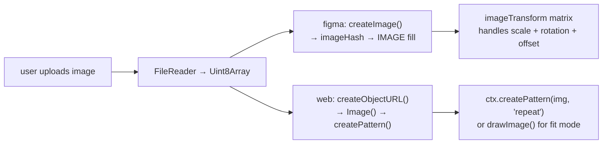
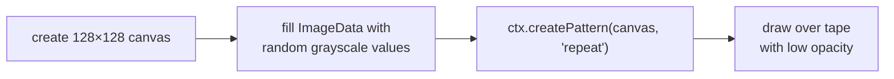
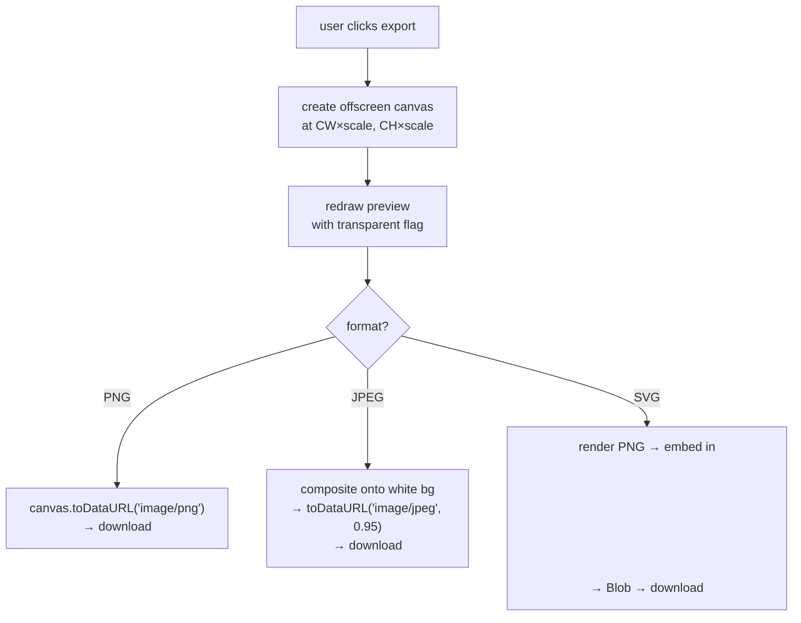

# under the hood

technical deep-dive into how taperd works — from geometry math to rendering pipelines.

---

## architecture overview



the plugin has two halves:
- **ui.html** runs in an iframe — renders the live canvas preview and all controls
- **code.ts** runs in figma's sandbox — receives messages from the UI and builds vector nodes via the plugin API

the web version is a self-contained single HTML file that reuses the preview rendering logic and adds export functionality.

---

## roll geometry

the tape dispenser is a **cylinder viewed from slightly above-front** — like looking at a cup of coffee on a table from a seated position.



### roll radius calculation

the outer radius of the roll changes based on how much tape has been dispensed:

**infinite mode** (default):
```
outerR = coreR + (maxR - coreR) × (0.28 + 0.72 × e^(-0.0026 × tapeWidth))
```
uses exponential decay — the roll shrinks quickly at first, then plateaus. never fully depletes.

**finite mode**:
```
outerR = sqrt(coreR² + (maxR² - coreR²) × (1 - tapeWidth/maxTape))
```
uses **area-preserving math** — the cross-sectional area of tape on the roll decreases linearly as tape is pulled. this means the radius follows a square-root curve (shrinks slowly when full, fast when nearly empty), which matches real physics.



---

## rendering pipeline

### figma plugin (vector output)



key implementation details:

1. **mask workflow**: figma masks require a specific sequence:
   - create the mask shape with a fill
   - insert it adjacent to the target
   - group them together with `figma.group()`
   - set `isMask = true` AFTER grouping
   - mask must be the bottom child in the group

2. **z-ordering**: the tape group is moved to index 0 in the container (`container.insertChild(0, tapeGroup)`) so roll elements render on top — matching the preview where the spool is drawn after the ribbon.

3. **zigzag path**: the serrated edge is built as SVG-style path data:
   ```
   M start → L across top → zigzag down right edge → L across bottom → zigzag up left edge → Z
   ```
   each tooth is a peak-valley pair: `L (x+depth, midY)` then `L (x, bottomY)`

### web version (canvas rendering)



### zigzag edge technique comparison

| | figma plugin | web (opaque bg) | web (transparent bg) |
|---|---|---|---|
| technique | vector mask with `isMask` | fill background color over edge | `destination-out` compositing |
| how it works | mask shape clips tape frame | brown rectangles cover straight edges, leaving zigzag visible | erase pixels beyond zigzag boundary |
| supports transparency | yes (mask is alpha-based) | no (requires solid bg) | yes (erases to transparent) |

---

## pattern rendering

### built-in patterns

built-in patterns are drawn procedurally — no image assets required.



in the **figma plugin**, patterns are rendered as inline SVG strings passed to `figma.createNodeFromSvg()`, producing editable vector groups.

in the **web version**, patterns are drawn directly to the canvas context using `beginPath()`, `arc()`, `bezierCurveTo()`, etc.

### custom image patterns



the figma plugin applies pattern transforms via a 2×3 affine matrix:
```
[[cos/scale, -sin/scale, tx],
 [sin/scale,  cos/scale, ty]]
```
where tx/ty incorporate the user's offset values.

---

## texture generation

textures are procedural noise overlays:



| texture | pixel strength | alpha range | overlay opacity |
|---|---|---|---|
| paper | 0–25 | 0–18 | 11% |
| rough | 0–55 | 0–44 | 24% |

the noise is regenerated each time the canvas context changes (e.g., during hi-res export).

---

## export pipeline (web)



---

## message protocol (plugin only)

the UI iframe communicates with the plugin backend via `postMessage`:

| message | direction | payload |
|---|---|---|
| `resize` | UI → plugin | `{ height }` |
| `get-frames` | UI → plugin | (none) |
| `frames-list` | plugin → UI | `{ frames: [{id, name}] }` |
| `get-frame-image` | UI → plugin | `{ frameId }` |
| `frame-image` | plugin → UI | `{ bytes, frameId }` |
| `add-to-canvas` | UI → plugin | full TapeMsg object with all parameters |

the `add-to-canvas` message carries ~20 fields covering every customization option, including raw pattern image bytes as a number array.
